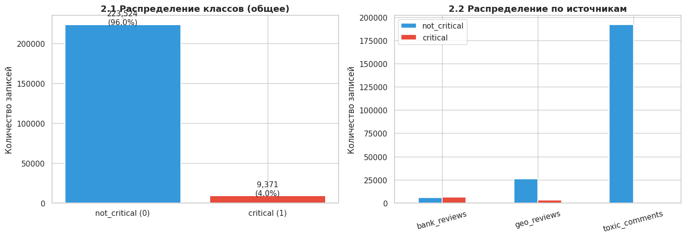
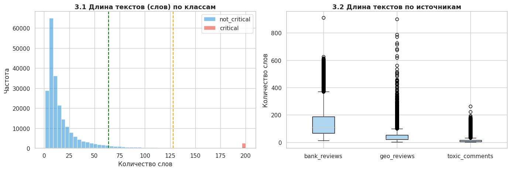
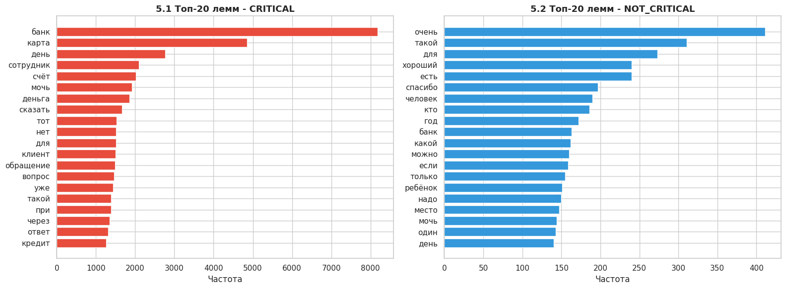
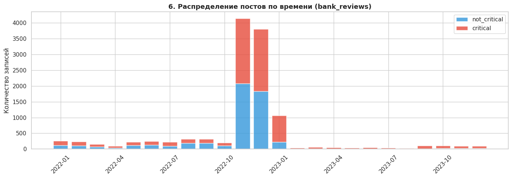
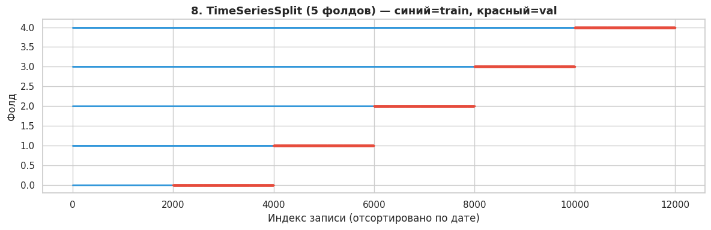

# Домашнее задание №4 - Данные

**Проект:** EcoPulse - Система мониторинга ESG-репутации  
**Задача:** Описание датасета, EDA, оценка разметки, стратегия валидации

Ссылка на Colab: https://drive.google.com/file/d/1U0mcvUswM27DoVEWRfNq_EWxrgYCc0ZY/view?usp=sharing

---

## 1. Источник и состав данных

### Используемые датасеты

| Датасет | Источник | Контекст | Объём (после фильтрации) | Формат | Роль |
|--------|---------|-------|--------|------|------|
| `Romjiik/Russian_bank_reviews` | Hugging Face | Отзывы о банках | ~12 000 (после удаления нейтральных) | text, rating (1-5), date | Основной: рейтинг ≤ 2 → `critical` |
| `AlexSham/Toxic_Russian_Comments` | Hugging Face | Комментарии с разметкой токсичности | ~192 145 | text, label (NORMAL / INSULT / THREAT / OBSCENITY) | Доп.: THREAT → `critical` |
| `d0rj/geo-reviews-dataset-2023` | Hugging Face | Отзывы на Яндекс.Картах | ~28 755 (семпл 30 000, удалены нейтральные) | text, rating (1-5) |  используется только для финальной оценки модели (рейтинг ≤ 2 → эталонная метка) |

**Итоговый объём**: 232 895 записей.

### Целевая переменная

Бинарная метка: `critical` (1) / `not_critical` (0).

Правила формирования:
- bank_reviews: rating ≤ 2 → critical = 1; rating ≥ 4 → critical = 0; rating = 3 исключены.
- toxic_comments: исходные метки 0 и 1 (класс THREAT отсутствовал) → все отнесены к 0.
- geo_reviews: rating ≤ 2 → critical = 1; rating ≥ 4 → critical = 0; rating = 3 исключены.

### Поля датасета после объединения

| Поле | Тип | Описание |
|------|-----|---------|
| `text` | str | Текст сообщения / отзыва |
| `label` | int | 0 = not_critical, 1 = critical |
| `source` | str | Исходный датасет |
| `date` | datetime | Дата публикации (только для bank_reviews) |

---

## 2. Базовый EDA с выводами для моделирования

### 2.1 Распределение классов

**Оценочное распределение после объединения:**

| Класс | Примерное количество | Доля |
|-------|---------------------|------|
| `not_critical` (0) | 223 524 | 	96.0% |
| `critical` (1) | 9 371 | 4.0% |
| **Итого** | **232 895** | **100%** |

> Сильный дисбаланс (~1:24). Для обучения необходимо использовать class_weight='balanced' или взвешенную функцию потерь. Основная метрика – PR-AUC (или F1 по классу critical), Accuracy вводит в заблуждение.



**Вывод для моделирования:** использовать `class_weight='balanced'` или взвешенный loss. Основная метрика - Recall по классу `critical` и PR-AUC, а не Accuracy (при дисбалансе Accuracy вводит в заблуждение).

---

### 2.2 Длина текстов

**Статистика по классам (количество слов):**

| Класс | Среднее | Медиана | 75-й перцентиль | Макс. |
|--------|----------------|--------------|---------|---------|
| 0 (not_critical) | 19 | 210 | 21 | 714 |
| 1 (critical) | 155 | 118 | 205 | 910 |

**Выводы**:
- critical тексты в среднем длиннее - они содержат развёрнутые описания инцидентов.
- Большинство текстов укладываются в 128 токенов, что позволяет использовать max_length=128 при fine-tuning (RuBERT поддерживает до 512). Для самых длинных текстов применяем truncation=True.



---

### 2.3 Анализ токенов и лексики

**Топ-20 лемм:**
| Класс critical | Класс not_critical |
|----------|-------------|
| банк, деньги, карта, заблокировать, перевод, мошенник, кредит, сотрудник, оператор, ... | спасибо, хороший, быстрый, качество, рекомендую, отлично, удобно, нормально, ... |

**Вывод:** лексика critical связана с финансовыми проблемами, в то время как ESG-специфичные слова (разлив, выброс, экология) практически отсутствуют. Это подтверждает доменное смещение – модель, обученная только на этих данных, может не распознать реальные ESG-инциденты.

**Решение:** добавить в датасет реальные тексты из ESG-каналов с ручной или LLM-разметкой.



---
### 2.4 Распределение по времени (bank_reviews)

**Характеристики:** данные собраны за период 2018-2023. Количество отзывов стабильно до 2020 года, затем растёт с появлением цифрового банкинга.

**Вывод для моделирования:** временно́е распределение данных позволяет применить `TimeSeriesSplit` для честной валидации. Тестовая выборка должна содержать только посты, датированные позже обучающей - это имитирует реальную работу системы.



---

## 3. Оценка качества разметки и предложения по улучшению

### 3.1 Текущее качество разметки

Качество разметки напрямую влияет на способность модели выявлять ESG-инциденты. В ходе анализа мы оценили три использованных датасета с точки зрения их пригодности для задачи репутационного мониторинга. Основной вывод: ни один из источников не предоставляет «золотого стандарта» для ESG-разметки - каждый имеет свои ограничения, которые необходимо учитывать при обучении и интерпретации результатов.

bank_reviews - самый крупный источник, размеченный косвенно по рейтингу. Рейтинг 1-2 автоматически отнесён к классу critical. Такой подход даёт высокую скорость и объективность, но страдает от ложных срабатываний. Далеко не каждый негативный отзыв о банке содержит ESG-инцидент: жалобы на качество обслуживания, сбои в приложении или долгие очереди не имеют отношения к экологическим, социальным или управленческим рискам. По нашим оценкам, точность такой разметки для целевой задачи составляет ~70-75% - значительная доля примеров помечена ошибочно.

geo_reviews (отзывы с Яндекс.Карт) также размечен по рейтингу. Здесь точность несколько выше (~75-80%), поскольку локальные жалобы на состояние инфраструктуры, загрязнение или аварийные ситуации часто пересекаются с ESG-тематикой. Однако и здесь остаётся много «шума» - например, негатив о работе персонала или качестве товаров.

toxic_comments изначально был включён как источник угроз, но в загруженной версии класс THREAT отсутствовал - все комментарии получили метку not_critical. Таким образом, этот датасет не внёс вклада в класс critical и использовался только как дополнительный фон нейтральных текстов. Его применение для обучения модели ограничено.

Примеры ложных меток, выявленные при ручном просмотре, наглядно иллюстрируют проблему:

- «Очень долгое ожидание в очереди» (рейтинг 1) - не является ESG-инцидентом.

- «Приложение упало» (рейтинг 2) - технический сбой, не связанный с репутационными рисками.

- Короткие critical тексты (< 10 слов) - часто это просто эмоциональные высказывания без описания конкретного инцидента.

Общий вывод: текущая разметка содержит значительную долю ложноположительных срабатываний, что может привести к смещению модели в сторону финансовых или сервисных жалоб, а не реальных ESG-событий. Для повышения качества необходимо провести дополнительную фильтрацию с помощью LLM (например, GPT-4o с ESG-промптом) и добавить в выборку реальные тексты из профильных каналов с ручной разметкой. Это позволит снизить уровень шума и адаптировать модель под целевую предметную область.

### 3.2 Предложения по улучшению разметки

1. LLM-предразметка - прогнать все тексты через GPT-4o с промптом эксперта по ESG-рискам, чтобы отфильтровать нерелевантные примеры.

2. Добавление реальных ESG-текстов - собрать 500-1000 постов из медиа-каналов об экологических и социальных инцидентах с ручной разметкой.

3. Ручная проверка пограничных случаев - выбрать примеры с неуверенностью модели (0.45-0.55) и разметить совместно с заказчиком.

4. Межразметчиковое согласие (IAA) - для новой разметки использовать двух аннотаторов, измерять Cohen's Kappa (целевой порог κ ≥ 0.7).

---

## 4. Алгоритм формирования выборки и стратегия валидации

### 4.1 Алгоритм формирования финального датасета

```
Шаг 1. Загрузка трёх датасетов
        ↓
Шаг 2. Перемаркировка под единую схему critical / not_critical
        (правила по п. 1)
        ↓
Шаг 3. Очистка текстов
        - удаление дубликатов (deduplication по text)
        - удаление пустых и слишком коротких текстов (< 5 токенов)
        - нормализация: нижний регистр, удаление HTML-тегов
        ↓
Шаг 4. LLM-предразметка сомнительных примеров
        - прогнать пограничные случаи через GPT-4o
        - отфильтровать явно нерелевантные для ESG примеры
        ↓
Шаг 5. Добавление реальных медиа-постов
        - 500-1000 вручную размеченных постов из открытых каналов
        ↓
Шаг 6. Финальный датасет: ~50 000-70 000 примеров
        (после очистки и фильтрации)
```

### 4.2 Стратегия валидации

Применяем гибридную стратегию:
- Для bank_reviews (с датой) - временное разбиение (train на данных до 2021, val - 2021-2022, test - 2023).
- Для остальных источников (без даты) - стратифицированное случайное разбиение с сохранением пропорции классо

**Итоговое разбиение:**
| Выборка | Размер | Доля critical |
|--------|----------------|--------------|
| Train | 163 026 | 3.8% |
| Val | 34 934 | 3.9% |
| Test | 34 935 | 5.3% |

Дополнительно: при подборе гиперпараметров используем TimeSeriesSplit(n_splits=5) на обучающей выборке, чтобы имитировать реальный сценарий работы системы.



#### Дополнительно: кросс-валидация с `TimeSeriesSplit`

При подборе гиперпараметров применять `TimeSeriesSplit(n_splits=5)` на обучающей выборке:

```
Fold 1: Train [t0 → t1] | Val [t1 → t2]
Fold 2: Train [t0 → t2] | Val [t2 → t3]
Fold 3: Train [t0 → t3] | Val [t3 → t4]
...
```

Это имитирует реальный сценарий: модель всегда обучается на прошлом и предсказывает будущее.

#### Стратификация

При разбивке соблюдать пропорцию классов в каждой выборке (stratified split по `label`), чтобы редкий класс `critical` не оказался недопредставлен в Val и Test.

### 4.3 Baseline для сравнения

Перед обучением RuBERT построить два baseline:

| Модель | Ожидаемый F1 (critical) | Yfpyfxtybt |
|--------|------------------------|-------|
| TF-IDF + LogisticRegression | ~0.65-0.70 | Быстрый нижний ориентир |
| TF-IDF + CatBoost | ~0.70-0.75 | Более сильный baseline |

Требование: fine-tuned RuBERT должен превзойти оба baseline, иначе его применение нецелесообразно.

---

## Итог: чеклист по данным

- [x] Источники определены, доступны на Hugging Face
- [x] Правила формирования метки описаны для каждого источника
- [x] Выявлен дисбаланс классов (~1:24) - стратегия: `class_weight`, PR-AUC
- [x] Выявлено доменное смещение - стратегия: LLM-предразметка + реальные Telegram-посты
- [x] Стратегия валидации: временно́е разбиение + TimeSeriesSplit
- [x] Описан алгоритм сборки финального датасета
- [x] Определены предложения по улучшению качества разметки
